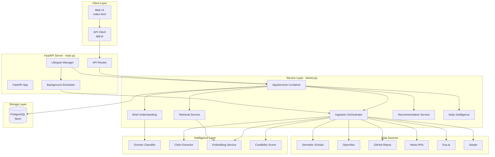
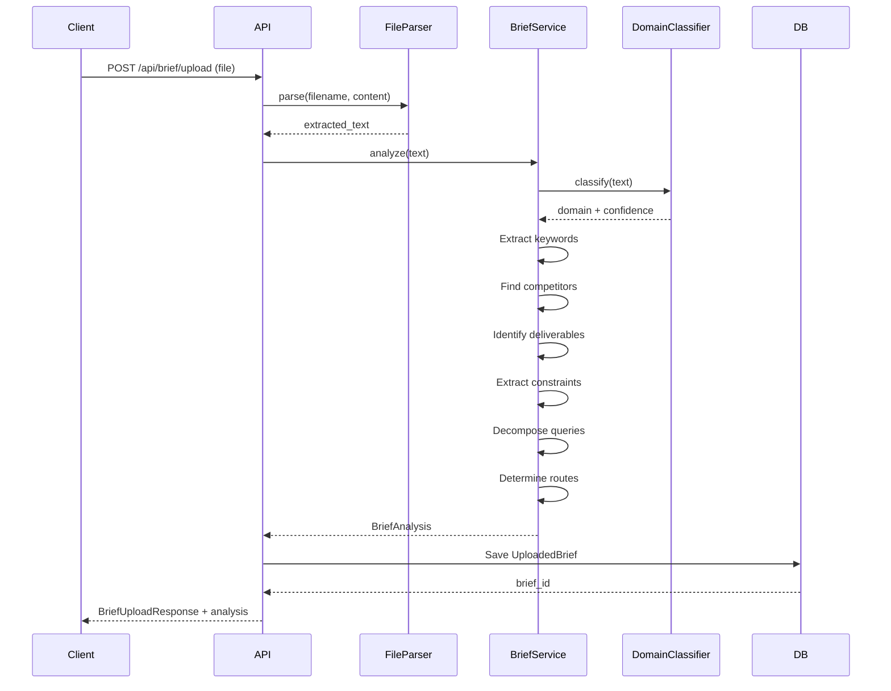
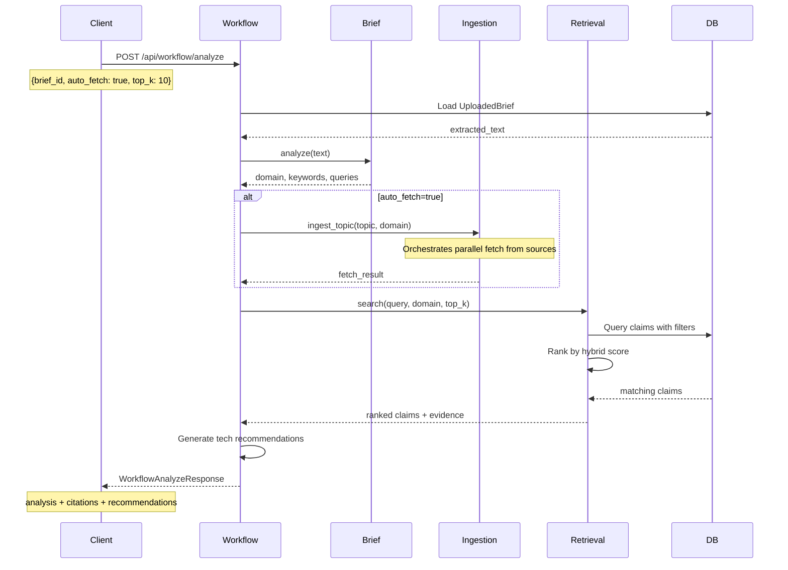
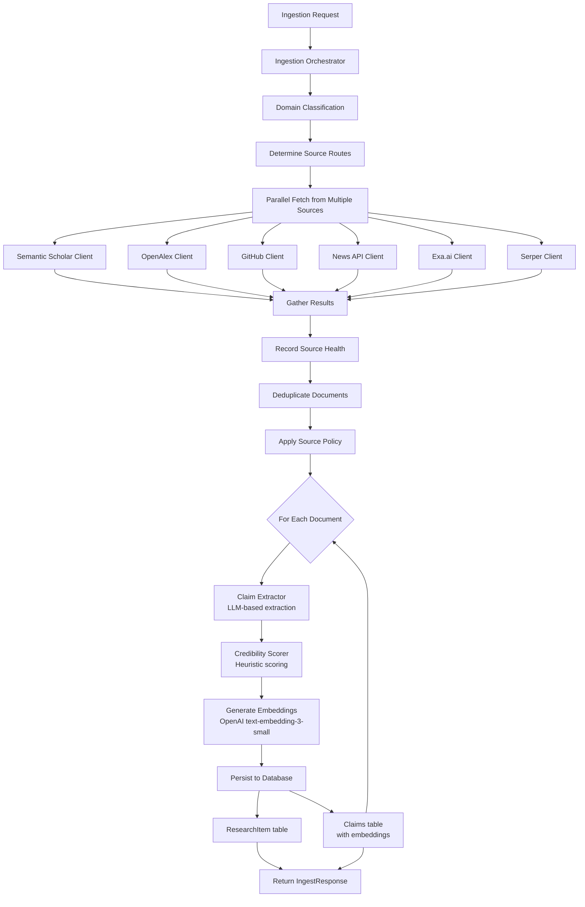
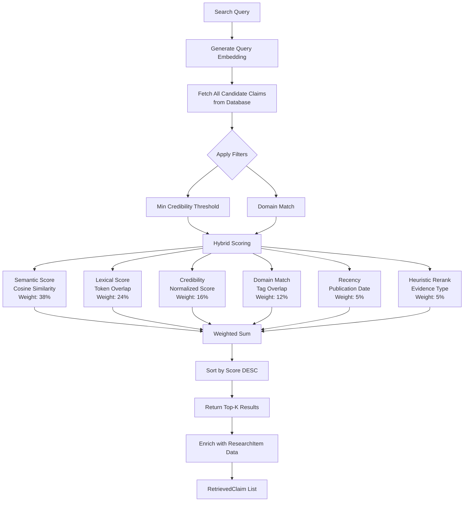
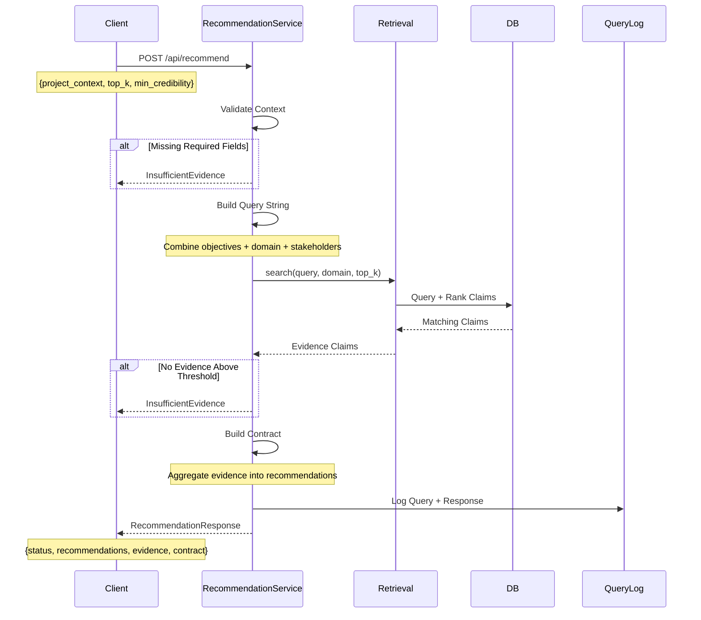

# Research Intelligence Platform - Complete Logic Flow

## 🏗️ **System Architecture Overview**



---

## 📊 **Complete Request Flow**

### **1. Server Startup (main.py)**
```
┌─────────────────────────────────────────────────────────┐
│ FastAPI Lifespan Context Manager                         │
├─────────────────────────────────────────────────────────┤
│ 1. Load Settings (.env)                                  │
│ 2. Initialize Database (create tables)                   │
│ 3. Build Services (factory.py)                          │
│    - Domain Classifier                                   │
│    - Brief Understanding                                 │
│    - Embeddings (OpenAI)                                │
│    - Claim Extractor                                     │
│    - Credibility Scorer                                  │
│    - Retrieval Service                                   │
│    - Ingestion Orchestrator                             │
│    - Recommendation Service                              │
│    - Daily Intelligence Service                          │
│ 4. Start Background Scheduler                           │
│    - Research ingestion (daily)                         │
│    - Developer ingestion (daily)                        │
│    - Daily intelligence email (daily)                   │
│ 5. Attach services to app.state                        │
└─────────────────────────────────────────────────────────┘
```

---

### **2. Brief Upload & Analysis Workflow**



**Brief Analysis Components:**
- **Domain Classification**: AI/ML, Developer, Business Intelligence, Legal, Partner, Competitive
- **Intent Extraction**: What the brief is asking for
- **Entity Recognition**: Companies, technologies, tools mentioned
- **Query Decomposition**: Breaking brief into searchable sub-queries
- **Route Planning**: Which data sources to use (semantic scholar, GitHub, news, etc.)
- **Constraint Parsing**: Limitations, out-of-scope items, dependencies

---

### **3. Full Workflow Analysis (Brief → Fetch → Recommendations)**



---

### **4. Data Ingestion Pipeline (Deep Dive)**



**Ingestion Components:**

1. **Source Clients** (ingestion/clients.py):
   - SemanticScholarClient: Academic papers (AI/ML focus)
   - OpenAlexClient: Research papers (broad coverage)
   - GitHubClient: Repositories, README analysis
   - GNewsClient: News articles
   - ExaClient: Neural web search
   - SerperClient: Google search results

2. **Claim Extraction** (intelligence/extraction.py):
   - Uses OpenAI GPT-4 to extract structured claims
   - Identifies evidence type (experiment, case study, benchmark)
   - Extracts metrics, conditions, limitations
   - Tags applicability domains

3. **Credibility Scoring** (intelligence/credibility.py):
   ```
   Score = Citation Weight + Source Weight + Metadata + Recency
   - Citation Weight: Based on citation count buckets
   - Source Weight: Tier 1 (100) > Tier 2 (85) > Unknown (60)
   - Metadata Quality: Authors, venue, structured data
   - Recency: Recent papers get boost
   ```

4. **Embedding Generation** (intelligence/embeddings.py):
   - OpenAI text-embedding-3-small (1536 dimensions)
   - Embeds: claim_text + evidence_summary + tags
   - Stored in Claims table for retrieval

---

### **5. Retrieval & Search Pipeline**



**Scoring Formula:**
```
Final Score = 0.38×Semantic + 0.24×Lexical + 0.16×Credibility 
            + 0.12×Domain + 0.05×Recency + 0.05×Rerank
```

---

### **6. Recommendation Generation**



**Recommendation Contract Structure:**
- **Core Recommendation**: Main approach/solution
- **Evidence Items**: Supporting claims with credibility scores
- **Implementation Notes**: Step-by-step guidance
- **Alternative Approaches**: If applicable
- **Risks & Limitations**: Based on evidence
- **Dependencies**: Technical requirements

---

### **7. Background Scheduler Jobs**

```mermaid
gantt
    title Daily Automated Tasks
    dateFormat HH:mm
    axisFormat %H:%M
    
    section Research
    Research Ingestion (2 AM UTC): done, 02:00, 1h
    
    section Developer
    Developer Ingestion (3 AM UTC): done, 03:00, 1h
    
    section Intelligence
    Daily Report Generation (8 AM UTC): done, 08:00, 30m
    Daily Email Delivery: done, 08:30, 15m
```



**Scheduled Jobs** (scheduler.py):

1. **Research Ingestion** (2 AM UTC):
   - Fetches papers for configured topics
   - Example: "retrieval augmented generation", "vector search"
   - Domain: AI/ML
   - Max per source: 50 papers

2. **Developer Ingestion** (3 AM UTC):
   - Fetches GitHub repos, SDKs, tools
   - Topics: "RAG developer tooling", "vector database SDK"
   - Domain: Developer Tooling
   - Max per source: 30 repos

3. **Daily Intelligence Email** (8 AM UTC):
   - Aggregates top findings
   - Trends analysis
   - Sends via Resend API

---

## 🗄️ **Database Schema Flow**

```
┌──────────────────┐      ┌──────────────────┐      ┌──────────────────┐
│  ResearchItem    │      │     Claim        │      │  UploadedBrief   │
├──────────────────┤      ├──────────────────┤      ├──────────────────┤
│ research_id (PK) │◄─────┤ claim_id (PK)    │      │ brief_id (PK)    │
│ source_url       │      │ research_id (FK) │      │ filename         │
│ source_type      │      │ claim_text       │      │ extracted_text   │
│ source_name      │      │ evidence_summary │      │ analysis (JSON)  │
│ credibility_score│      │ evidence_type    │      │ metadata_json    │
│ title            │      │ confidence       │      └──────────────────┘
│ authors (JSON)   │      │ embedding (JSON) │
│ domain_tags(JSON)│      │ applicability    │
│ raw_text         │      │   _tags (JSON)   │
└──────────────────┘      └──────────────────┘

┌──────────────────┐      ┌──────────────────┐      ┌──────────────────┐
│   QueryLog       │      │    Feedback      │      │  IngestionRun    │
├──────────────────┤      ├──────────────────┤      ├──────────────────┤
│ query_id (PK)    │      │ feedback_id (PK) │      │ run_id (PK)      │
│ project_context  │      │ query_id         │      │ topic            │
│ response (JSON)  │      │ rating           │      │ domain           │
│ latency_ms       │      │ notes            │      │ status           │
│ status           │      │ recommendation   │      │ documents_seen   │
└──────────────────┘      └──────────────────┘      │ claims_inserted  │
                                                     └──────────────────┘
```

---

## 🔍 **Key Intelligence Components**

### **Domain Classifier** (intelligence/domain.py)
```python
Domains:
- AI/ML (research, embeddings, RAG)
- Developer Tooling (SDKs, APIs, frameworks)
- Business Intelligence (partners, competitive)
- Legal (contracts, compliance)
- Partner Ecosystem
- Competitive Intelligence

Routes (Source Selection):
AI/ML → Semantic Scholar, OpenAlex, GitHub (ML repos)
Developer → GitHub, Documentation, Stack Overflow
Business → News APIs, Market Research
```

### **Claim Extractor** (intelligence/extraction.py)
```python
Uses: OpenAI GPT-4
Input: RawDocument (title, text, metadata)
Output: List[ExtractedClaim]
  - claim_text: The factual statement
  - evidence_summary: Supporting evidence
  - evidence_type: experiment | case_study | benchmark | survey
  - metrics: Performance numbers
  - conditions: When it applies
  - limitations: Known constraints
  - applicability_tags: Domain keywords
```

### **Credibility Scorer** (intelligence/credibility.py)
```python
Scoring Factors:
1. Citation Count (0-40 points)
   - Tier 1 (100+ citations): 40 pts
   - Tier 2 (50-99): 30 pts
   - Tier 3 (10-49): 20 pts
   - Emerging (<10): 10 pts

2. Source Authority (0-30 points)
   - Tier 1 (Nature, Science, ACM): 30 pts
   - Tier 2 (IEEE, Springer): 25 pts
   - Unknown: 15 pts

3. Metadata Quality (0-15 points)
   - Has authors, venue, structured data

4. Recency Boost (0-15 points)
   - <1 year: +15 pts
   - 1-3 years: +10 pts
   - 3-6 years: +5 pts
```

### **Embedding Service** (intelligence/embeddings.py)
```python
Model: text-embedding-3-small
Dimensions: 1536
Usage:
  - Query embedding for retrieval
  - Claim embedding for storage
  - Cosine similarity for ranking
```

---

## 🎯 **API Endpoint Summary**

### **GET Endpoints**
1. `GET /api/health` → System health + connector status
2. `GET /api/stats` → Database statistics (items, claims, queries)
3. `GET /api/sources` → Source health monitoring
4. `GET /api/ingestion-runs` → Recent ingestion history

### **POST Endpoints**
1. `POST /api/brief/analyze` → Analyze text brief
2. `POST /api/brief/upload` → Upload file (PDF, DOCX, TXT)
3. `POST /api/ingest` → Trigger manual ingestion
4. `POST /api/workflow/analyze` → Full analysis pipeline
5. `POST /api/claims/search` → Search knowledge base
6. `POST /api/recommend` → Generate recommendations
7. `POST /api/feedback` → Submit user feedback
8. `POST /api/daily-intelligence` → Generate daily report

---

## 🔄 **Data Flow Summary**

```
┌─────────────────────────────────────────────────────────────┐
│                    USER INTERACTION                          │
└─────────────────────────────────────────────────────────────┘
                            │
                            ▼
┌─────────────────────────────────────────────────────────────┐
│         BRIEF UPLOAD → ANALYSIS → DOMAIN CLASSIFICATION     │
└─────────────────────────────────────────────────────────────┘
                            │
                            ▼
┌─────────────────────────────────────────────────────────────┐
│     AUTO-FETCH (INGESTION) → PARALLEL SOURCE QUERIES        │
│     • Semantic Scholar  • OpenAlex  • GitHub                │
│     • News APIs        • Exa.ai     • Serper                │
└─────────────────────────────────────────────────────────────┘
                            │
                            ▼
┌─────────────────────────────────────────────────────────────┐
│    CLAIM EXTRACTION → CREDIBILITY SCORING → EMBEDDINGS      │
└─────────────────────────────────────────────────────────────┘
                            │
                            ▼
┌─────────────────────────────────────────────────────────────┐
│              STORAGE (PostgreSQL + Vector Data)              │
└─────────────────────────────────────────────────────────────┘
                            │
                            ▼
┌─────────────────────────────────────────────────────────────┐
│    RETRIEVAL → HYBRID RANKING → EVIDENCE AGGREGATION        │
└─────────────────────────────────────────────────────────────┘
                            │
                            ▼
┌─────────────────────────────────────────────────────────────┐
│     RECOMMENDATION GENERATION → STRUCTURED CONTRACT          │
└─────────────────────────────────────────────────────────────┘
                            │
                            ▼
┌─────────────────────────────────────────────────────────────┐
│                    RESPONSE TO USER                          │
└─────────────────────────────────────────────────────────────┘
```

---

## 📝 **Configuration (.env)**

```ini
# API Keys for Data Sources
OPENAI_API_KEY=...              # LLM + Embeddings
SEMANTIC_SCHOLAR_API_KEY=...    # Academic papers
GITHUB_TOKEN=...                # GitHub repos
GNEWS_API_KEY=...               # News articles
EXA_API_KEY=...                 # Neural web search
SERPER_API_KEY=...              # Google search

# Database
DATABASE_CONNECTION_STRING=postgresql://...

# Email (Resend)
RESEND_API_KEY=...
EMAIL_FROM=...

# Ingestion Settings
MAX_PAPERS_PER_SOURCE=50
FETCH_INTERVAL_HOURS=6
RESEARCH_FETCH_HOUR=2
DEVELOPER_FETCH_HOUR=3
```

---

## 🚀 **Startup Sequence**

1. **Load Environment** (.env file)
2. **Initialize Database** (create tables if missing)
3. **Build Services** (all intelligence + ingestion services)
4. **Start Scheduler** (background jobs)
5. **Mount Routes** (API endpoints)
6. **Start Uvicorn** (ASGI server on port 8000)

Server ready at: `http://127.0.0.1:8000`

---

## 💡 **Key Design Patterns**

1. **Service Factory Pattern**: All services built via `build_services()`
2. **Dependency Injection**: Services passed through FastAPI `Depends()`
3. **Async Pipeline**: Parallel source fetching with `asyncio.gather()`
4. **Hybrid Retrieval**: Combines semantic (embeddings) + lexical (BM25-like)
5. **Domain-Aware Routing**: Different sources for different domains
6. **Credibility-Based Filtering**: Only high-quality evidence surfaces
7. **Structured Extraction**: LLM converts raw docs to structured claims
8. **Background Automation**: Daily scheduled ingestion and reporting

---

## 🎓 **Core Intelligence Algorithms**

### **Brief Understanding Pipeline**
```
Text → Tokenization → Keyword Extraction → Domain Classification
     → Query Decomposition → Route Selection → Constraint Parsing
```

### **Ingestion Pipeline**
```
Topic → Source Routing → Parallel Fetch → Deduplication
     → Claim Extraction (LLM) → Credibility Scoring (Heuristic)
     → Embedding Generation (OpenAI) → Database Storage
```

### **Retrieval Pipeline**
```
Query → Query Embedding → Candidate Fetch → Hybrid Scoring
     → (0.38×Semantic + 0.24×Lexical + 0.16×Credibility
        + 0.12×Domain + 0.05×Recency + 0.05×Rerank)
     → Sort & Filter → Top-K Results
```

### **Recommendation Pipeline**
```
Context Validation → Query Construction → Evidence Retrieval
     → Evidence Filtering (min credibility) → Contract Building
     → Risk Assessment → Alternative Analysis → Structured Response
```

---

**END OF ARCHITECTURE FLOW DOCUMENTATION**
