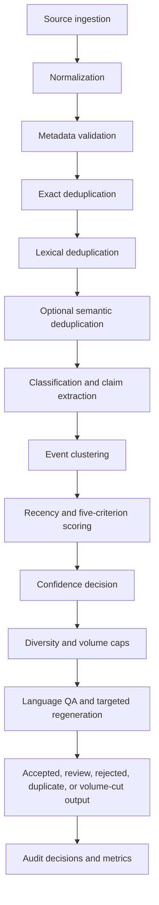

# Signal Filter architecture

The signal filter is an additive, typed pipeline under `research_intel.signal_filter`. Raw title and body fields are preserved while normalized fields and stable fingerprints are derived. Cheap validation and exact/lexical duplicate checks run before optional embedding or intelligence-provider calls. A failure is terminal unless its decision explicitly routes the item to review.

`EmbeddingProvider`, `IntelligenceProvider`, and `HistoricalRepository` are protocols. Production deployments can inject OpenAI, local, or other implementations without coupling pipeline stages to one vendor. In the absence of an intelligence provider, heuristic scores are marked by low confidence and normally enter human review.

Event clustering currently uses conservative title similarity. Semantic event extraction, primary-source selection, unique-claim merging, and independent-confirmation retention require a configured intelligence provider and production corpus.
